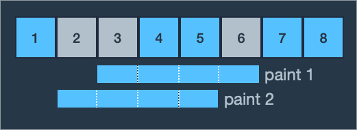

# 문제 설명
어느 학교에 페인트가 칠해진 길이가 `n`미터인 벽이 있습니다. 벽에 동아리 · 학회 홍보나 회사 채용 공고 포스터 등을 게시하기 위해 테이프로 붙였다가 철거할 때 떼는 일이 많고 그 과정에서 페인트가 벗겨지곤 합니다. 페인트가 벗겨진 벽이 보기 흉해져 학교는 벽에 페인트를 덧칠하기로 했습니다.

넓은 벽 전체에 페인트를 새로 칠하는 대신, 구역을 나누어 일부만 페인트를 새로 칠 함으로써 예산을 아끼려 합니다. 이를 위해 벽을 1미터 길이의 구역 `n`개로 나누고, 각 구역에 왼쪽부터 순서대로 1번부터 `n`번까지 번호를 붙였습니다. 그리고 페인트를 다시 칠해야 할 구역들을 정했습니다.

- 벽에 페인트를 칠하는 롤러의 길이는 `m`미터이고, 롤러로 벽에 페인트를 한 번 칠하는 규칙은 다음과 같습니다.

    - 롤러가 벽에서 벗어나면 안 됩니다.
    - 구역의 일부분만 포함되도록 칠하면 안 됩니다.

즉, 롤러의 좌우측 끝을 구역의 경계선 혹은 벽의 좌우측 끝부분에 맞춘 후 롤러를 위아래로 움직이면서 벽을 칠합니다. 현재 페인트를 칠하는 구역들을 완전히 칠한 후 벽에서 롤러를 떼며, 이를 벽을 한 번 칠했다고 정의합니다.

한 구역에 페인트를 여러 번 칠해도 되고 다시 칠해야 할 구역이 아닌 곳에 페인트를 칠해도 되지만 다시 칠하기로 정한 구역은 적어도 한 번 페인트칠을 해야 합니다. 예산을 아끼기 위해 다시 칠할 구역을 정했듯 마찬가지로 롤러로 페인트칠을 하는 횟수를 최소화하려고 합니다.

정수 `n`, `m`과 다시 페인트를 칠하기로 정한 구역들의 번호가 담긴 정수 배열 `section`이 매개변수로 주어질 때 **롤러로 페인트칠해야 하는 최소 횟수를 return 하는 solution 함수를 작성해 주세요.**

# 제한사항
- 1 ≤ `m` ≤ `n` ≤ 100,000
- 1 ≤ `section`의 길이 ≤ n
- 1 ≤ `section`의 원소 ≤ n
- `section`의 원소는 페인트를 다시 칠해야 하는 구역의 번호입니다.
- `section`에서 같은 원소가 두 번 이상 나타나지 않습니다.
- `section`의 원소는 오름차순으로 정렬되어 있습니다.


# 입출력 예

|n|	m|section|result|
|--|--|--|--|
|8|	4|[2, 3, 6]|2|
|5|	4|[1, 3]|1|
|4|	1|[1, 2, 3, 4]|4|

# 입출력 예 설명

## 입출력 예 #1

예제 1번은 2, 3, 6번 영역에 페인트를 다시 칠해야 합니다. 
롤러의 길이가 4미터이므로 한 번의 페인트칠에 연속된 4개의 구역을 칠할 수 있습니다. 
처음에 3, 4, 5, 6번 영역에 페인트칠을 하면 칠해야 할 곳으로 2번 구역만 남고 1, 2, 3, 4번 구역에 페인트칠을 하면 2번 만에 다시 칠해야 할 곳에 모두 페인트칠을 할 수 있습니다.



- 2번보다 적은 횟수로 2, 3, 6번 영역에 페인트를 덧칠하는 방법은 없습니다. 
- 따라서 최소 횟수인 2를 return 합니다.

## 입출력 예 #2

예제 2번은 1, 3번 영역에 페인트를 다시 칠해야 합니다. 
롤러의 길이가 4미터이므로 한 번의 페인트칠에 연속된 4개의 구역을 칠할 수 있고 1, 2, 3, 4번 영역에 페인트칠을 하면 한 번에 1, 3번 영역을 모두 칠할 수 있습니다.


- 따라서 최소 횟수인 1을 return 합니다.

## 입출력 예 #3

예제 3번은 모든 구역에 페인트칠을 해야 합니다. 
롤러의 길이가 1미터이므로 한 번에 한 구역밖에 칠할 수 없습니다. 
구역이 4개이므로 각 구역을 한 번씩만 칠하는 4번이 최소 횟수가 됩니다.


- 따라서 4를 return 합니다.

# 문제 풀이

## 내 풀이

1. 문제를 이해하는데에 어려움을 겪어서, 리스트를 통해 표시한 후 문제를 풀었음.

    - `wall`을 출력하면 `n`의 개수만큼 0이 들어있는 리스트 생성
    - 이때, `section`에 해당하는 영역은 1로 들어가도록 하여 구분.

```python
wall = [0] * n          
for paint in section:
    wall[paint-1] = 1   

'''
case 1 -> [ 0, 1, 1, 0, 0, 1, 0, 0 ]
case 2 -> [ 1, 0, 1, 0, 0 ]
case 3 -> [ 1, 1, 1, 1 ]
'''
```

2. 이후 m의 길이만큼 1을 0으로 변환하도록 작성
    - 만약 초기에 1이었는데 0으로 이미 변했다면 생략
    - 최종적으로 리스트 안에 0밖에 없다면 `answer`(색칠횟수) 출력

```python
for w in range(len(wall)):
    if wall[w] == 1: 
        wall[w:w+m] = [0] * m 
        answer += 1 
return answer
```

---

- 최종적으로 작성된 코드

```python
def solution(n, m, section):
    # 색칠횟수
    answer = 0

    # 벽 만들기
    wall = [0] * n                  # 벽을 나타내는 리스트 생성
    for paint in section:
        wall[paint-1] = 1           # 주어진 섹션에 해당하는 벽을 1로 표시

    # 벽 색칠하기    
    for w in range(len(wall)):
        if wall[w] == 1:            # 벽이 있는 부분인지 확인
            wall[w:w+m] = [0] * m   # 연속된 m개의 벽을 0으로 칠함
            answer += 1             # 색칠 횟수 증가
    
    return answer
```

## 다른 풀이

```python
def solution(n, m, section):
    answer = 1
    prev = section[0]
    for sec in section:
        if sec - prev >= m:
            prev = sec
            answer += 1

    return answer
```

- 함수 설명(GPT 참조)

    1. `answer`를 1로 초기화합니다. 이는 최소한 한 번은 새로운 섹션을 칠해야 하기 때문입니다.
    2. `prev` 변수를 사용하여 이전 섹션의 위치를 추적합니다. 초기에는 첫 번째 섹션의 위치로 설정됩니다.
    3. 주어진 섹션을 순회하면서 각 섹션의 위치 `sec`와 이전 섹션의 위치 `prev` 사이의 거리를 계산합니다.
    4. 만약 두 섹션 사이의 거리가 m 이상이면, 새로운 섹션을 칠할 수 있으므로 `answer`를 1 증가시킵니다.
    5. 이전 섹션의 위치 `prev`를 현재 섹션의 위치 `sec`로 업데이트합니다.
    6. 모든 섹션을 검사한 후에는 `answer`를 반환합니다.

    - 이 코드는 주어진 섹션에서 새로운 섹션을 최소한으로 칠하는 방법을 구하는데 사용될 수 있습니다.

- 이 방법이 정석적인 풀이인 듯!
